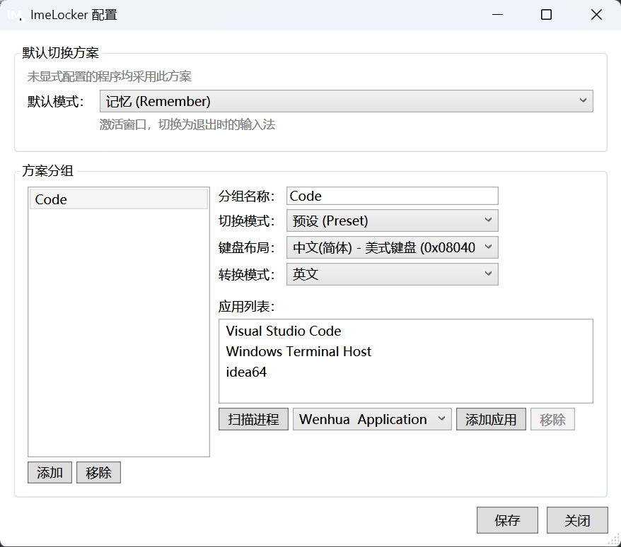

# ImeLocker

Windows 11 输入法锁定工具。自动根据前台应用切换或记忆输入法状态，告别窗口切换后输入法混乱的烦恼。



## 功能

- **预设模式 (Preset)**：切换到指定应用时，自动设置为预设的键盘布局和输入模式（如编程工具自动切英文）
- **记忆模式 (Remember)**：记住每个应用上次离开时的输入法状态，切回时自动恢复（如聊天工具保持中文）
- **分组管理**：将应用按使用场景分组，每组独立配置切换策略
- **系统托盘**：托盘图标实时显示当前输入法状态（英文 A / 中文 中），右键快速切换分组，双击打开配置窗口
- **明暗主题适配**：托盘图标自动适配 Windows 明暗主题，主题切换时实时刷新
- **热重载**：手动编辑 YAML 配置文件后即时生效，无需重启
- **开机自启**：一键设置，开机后自动在后台运行

## 安装

### 安装包（推荐）

从 [Releases](https://github.com/forever-utf8/ime-locker/releases) 下载 `ImeLocker-Setup.exe`，运行安装向导即可。

### 从源码编译

需要 [Podman](https://podman.io/)（Linux 容器化交叉编译）。

```bash
git clone https://github.com/forever-utf8/ime-locker.git
cd ime-locker
./build.sh                     # 编译 + 打包安装程序
./build.sh Release win-arm64   # ARM64 目标
```

产出：
- `publish/` — 可执行文件及依赖 DLL
- `output/ImeLocker-Setup.exe` — 安装包（Inno Setup 打包）

## 使用

1. 运行 `ImeLocker.exe`，托盘区出现图标
2. **右键托盘图标**：查看分组列表，点击可将当前应用移入指定分组
3. 首次运行自动创建默认配置，编程工具（VS Code、Windows Terminal、IntelliJ IDEA）预设为英文输入

## 配置

配置文件位于 `%APPDATA%\ImeLocker\config.yaml`，支持热重载。

```yaml
version: 1
defaultMode: preset

presetIme:
  keyboardLayout: "0x08040804"  # 微软拼音
  conversionMode: native        # 中文模式

groups:
  - name: "编程工具"
    mode: preset
    preset:
      keyboardLayout: "0x04090409"  # English (US)
      conversionMode: alphanumeric
    apps:
      - processName: "Code"
      - processName: "rider64"
      - processName: "WindowsTerminal"

  - name: "聊天工具"
    mode: remember
    apps:
      - processName: "WeChat"
      - processName: "Telegram"
```

### 配置说明

| 字段 | 说明 |
|------|------|
| `defaultMode` | 未匹配任何分组时的默认策略：`preset`（使用预设）或 `remember`（记忆状态） |
| `presetIme` | 默认预设的键盘布局和转换模式 |
| `groups[].mode` | 分组策略：`preset` 或 `remember` |
| `groups[].preset` | 仅 `preset` 模式需要，指定键盘布局和转换模式 |
| `groups[].apps[].processName` | 进程名，不含 `.exe` 后缀 |

### 常用键盘布局

| 布局 | 值 |
|------|------|
| English (US) | `0x04090409` |
| 微软拼音 | `0x08040804` |

## 技术栈

- .NET 9.0 (C#)、WPF + WinForms
- Windows API: `SetWinEventHook`、`ImmSetConversionStatus`、`ActivateKeyboardLayout`
- YamlDotNet、Serilog
- Inno Setup（安装包打包）

## License

MIT
